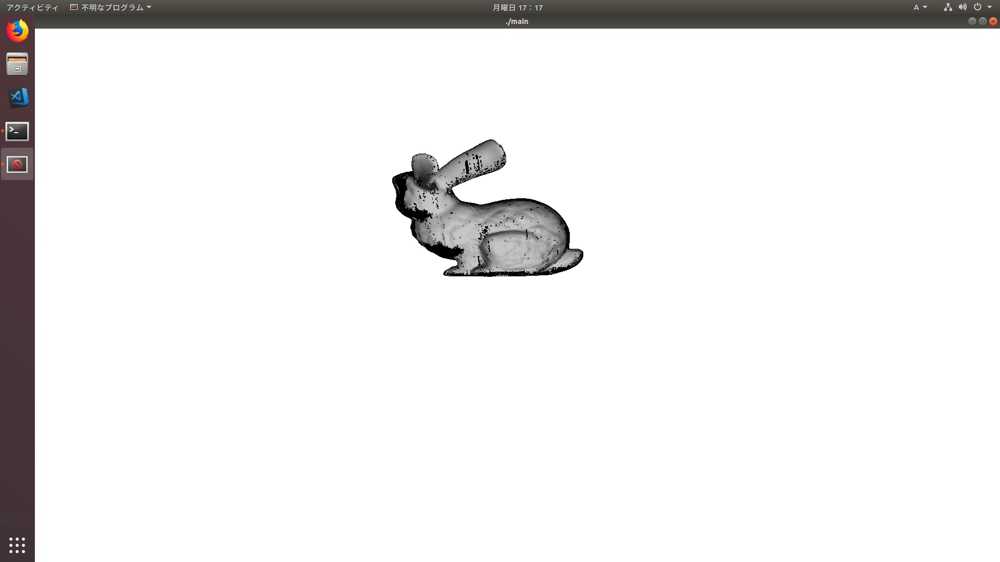

# OpenGL ESで3Dレンダラを作るプロジェクト

とりあえず、[Stanford Bunny](https://ja.wikipedia.org/wiki/%E3%82%B9%E3%82%BF%E3%83%B3%E3%83%95%E3%82%A9%E3%83%BC%E3%83%89%E3%83%90%E3%83%8B%E3%83%BC)を表示することを目標とする。

## 現状
スタンフォードバニーの読み込みには成功。一応表示できている。
ただし、ゴミが表示されている。原因を調査中。



## ビルド方法 (Ubuntu 18.04)
```
sudo apt install libglew-dev freeglut3-dev
./compile.sh
```

## 実行方法 (Ubuntu 18.04)
```
./main
```

## ビルド&実行方法 (Visual Studio 2019)
opengl_es_for_windows_slnをVS2019で開き、「▶ローカルWindowsデバッガー」をクリックするだけ。
最初のビルドでは、必要なパッケージがないと怒られるが、挫けずにもう一度押す。
そうすると、ビルドから実行までできる。