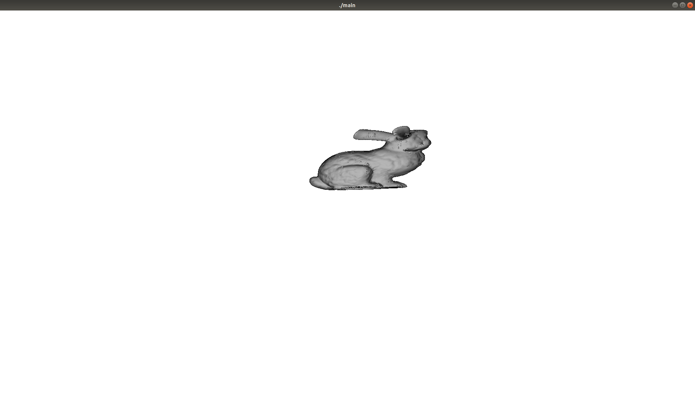

# OpenGLでなんか作ろうプロジェクト

とりあえず、[Stanford Bunny](https://ja.wikipedia.org/wiki/%E3%82%B9%E3%82%BF%E3%83%B3%E3%83%95%E3%82%A9%E3%83%BC%E3%83%89%E3%83%90%E3%83%8B%E3%83%BC)を表示することを目標とする。

## 現状
スタンフォードバニーの読み込みには成功。一応表示できている。
ただし、投影変換やライティングなど行っていないため、ただ黒い物体が表示されるだけ。

## 実行方法
Visual Studio 2017が必要。nugetでNupenGLを導入するとビルドできます。
